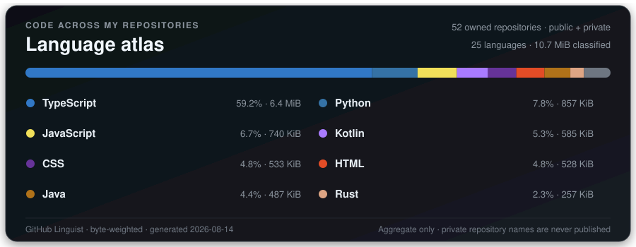

## 👋 Hi there, I’m Stoyan  

**Software Developer · Builder · Indie Hacker**  
#### Building small products with big intent — helping people organize their lives, think clearly, and take control of their time.
##### Turning ideas into products that create leverage, clarity, and freedom.

---

### 🧭 What I’m Building  
📝 **[Continuum](https://cntnm.xyz/)**  
*A local-first workspace for turning rough notes into live models*

🪾 **[GitGlow](https://gitglow.dev/)**  
*Analytics tool for your Git projects*

🗂️ **[SubKeep](https://subkeep.fyi))**  
*A Chrome extension that supercharges Google Keep with nested folders and better organization.*

🎮 **[Pangolines](https://pangolines.vercel.app/)**  
*A quirky 2D game inspired by Pang, featuring an armed pangolin and a ton of bubble-popping fun.*

---

### ⚙️ Languages & Tools  

 
  <!-- Mobile / Android -->
  
  
  

  <!-- More Languages -->
  
  

  <!-- Web / Frontend Frameworks -->
  
  
  

---

### 💬 Let’s Connect  

🐦 [Twitter / X](https://x.com/StoyanBuilds) — where I build in public  
🌐 [Website / Blog](https://skorudzhiev.github.io/)  
