## 👋 Hi there, I’m Stoyan  

**Android Developer · Builder · Indie Hacker**  
Crafting meaningful software that empowers people and makes a positive impact 🌱  

---

### 🧭 What I’m Building  

🚀 **[Green Compass](https://www.greencompass.app/)**  
*A sustainability platform built for individuals who want to live more consciously — track, act, and grow your eco-impact.*

🎮 **[Pangolines](https://pangolines.vercel.app/)**  
*A quirky 2D game inspired by Pang, featuring an armed pangolin and a ton of bubble-popping fun.*

🗂️ **[SubKeep](https://chromewebstore.google.com/detail/subkeep/mhikglflelkigbdlaebmfoopkoejecic?authuser=0&hl=en)**  
*A Chrome extension that supercharges Google Keep with nested folders and better organization.*

---

### ⚙️ Languages & Tools  

 
  
  
  
  

---

## 📊 GitHub Stats Galore  

  

---

### ✨ A Bit About Me  

- 🧑‍💻 Software Developer
- 💡 Passionate about building tools that *I* want to use   
- 🎯 Balancing code, creativity, and real-world impact  

---

### 🧩 Fun Zone  

 
   
   
  

---

### 💬 Let’s Connect  

🐦 [Twitter / X](https://x.com/StoyanBuilds) — where I build in public  
🌐 [Website / Blog](https://skorudzhiev.github.io/)  
